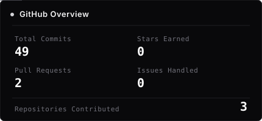
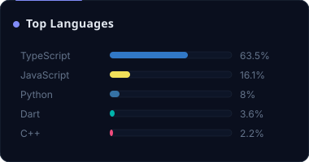
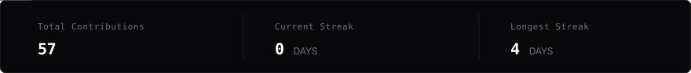

<!-- AUTOMATED REPOSITORY PROFILE — DO NOT EDIT DIRECTLY. EDIT templates/README.template.md -->

  <!-- HERO SECTION -->
  

    

  <!-- COMPACT SOCIAL / CONTACT NAVIGATION -->
  
  &nbsp;
  
  &nbsp;
  
  &nbsp;
  
  &nbsp;
  

 

## Identity & Focus

I am a Computer Science Engineering student based in Pune, India, building algorithmic systems, bio-inspired optimization tools, and full-stack software.

My work focuses on designing pragmatic computational systems — from workload-aware Ant Colony Optimization for AI inference load balancing (`AntLoad`), to graph-based emergency dispatch and knapsack bed-allocation engines (`NEXUS / Smart-City-Management`). I prioritize clean architectural separation, efficient data structures, and measurable performance over hype.

### Core Focus Areas
- **Algorithmic Systems & Optimization** — Bio-inspired heuristics (ACO, SHMS), graph routing, and dynamic load scheduling.
- **Full-Stack Engineering** — High-throughput backends and responsive web interfaces using TypeScript, Python, Next.js, and FastAPI.
- **Applied AI & Tooling** — Integrating proxy pipelines, inference routing, and developer-oriented AI workflows.

 

## Selected Work

<!-- START_SECTION:featured_projects -->
<table width="100%" border="0" cellpadding="0" cellspacing="0" style="border-collapse: separate; border-spacing: 0 14px;">
  <tr>
    <td style="background-color: #09090b; border: 1px solid #27272a; border-radius: 8px; padding: 20px 24px;">
      <table width="100%" border="0" cellpadding="0" cellspacing="0">
        <tr>
          <td valign="top">
            <h3 style="margin: 0 0 8px 0; font-size: 17px; font-weight: 700; font-family: -apple-system, BlinkMacSystemFont, 'Segoe UI', Roboto, sans-serif;">
              <a href="https://github.com/soham-arch/AntLoad" style="color: #ffffff; text-decoration: none;">AntLoad</a>
              ↗
            </h3>
            

              Workload-aware Ant Colony Optimization for dynamic load balancing in AI inference systems.
            

          </td>
        </tr>
        <tr>
          <td>
            <table border="0" cellpadding="0" cellspacing="0" style="font-family: monospace; font-size: 11.5px;">
              <tr>
                <td style="background-color: #141416; border: 1px solid #27272a; border-radius: 4px; padding: 3px 8px; color: #d4d4d8;">
                  TypeScript
                </td>
                <td style="padding-left: 14px; color: #71717a;">★ 0</td>
                <td style="padding-left: 14px; color: #71717a;">⑂ 0</td>
                <td style="padding-left: 14px; color: #52525b;">Updated Oct 2026</td>
                <td style="padding-left: 20px;">
                  <a href="https://github.com/soham-arch/AntLoad" style="color: #d4d4d8; text-decoration: none; font-weight: 600;">View Repository →</a>
                </td>
              </tr>
            </table>
          </td>
        </tr>
      </table>
    </td>
  </tr>
  <tr>
    <td style="background-color: #09090b; border: 1px solid #27272a; border-radius: 8px; padding: 20px 24px;">
      <table width="100%" border="0" cellpadding="0" cellspacing="0">
        <tr>
          <td valign="top">
            <h3 style="margin: 0 0 8px 0; font-size: 17px; font-weight: 700; font-family: -apple-system, BlinkMacSystemFont, 'Segoe UI', Roboto, sans-serif;">
              <a href="https://github.com/soham-arch/Smart-City-Management" style="color: #ffffff; text-decoration: none;">Smart-City-Management</a>
              ↗
            </h3>
            

              Emergency management and dispatch simulation for urban networks using classical DAA algorithms.
            

          </td>
        </tr>
        <tr>
          <td>
            <table border="0" cellpadding="0" cellspacing="0" style="font-family: monospace; font-size: 11.5px;">
              <tr>
                <td style="background-color: #141416; border: 1px solid #27272a; border-radius: 4px; padding: 3px 8px; color: #d4d4d8;">
                  JavaScript
                </td>
                <td style="padding-left: 14px; color: #71717a;">★ 0</td>
                <td style="padding-left: 14px; color: #71717a;">⑂ 0</td>
                <td style="padding-left: 14px; color: #52525b;">Updated Apr 2026</td>
                <td style="padding-left: 20px;">
                  <a href="https://github.com/soham-arch/Smart-City-Management" style="color: #d4d4d8; text-decoration: none; font-weight: 600;">View Repository →</a>
                </td>
              </tr>
            </table>
          </td>
        </tr>
      </table>
    </td>
  </tr>
  <tr>
    <td style="background-color: #09090b; border: 1px solid #27272a; border-radius: 8px; padding: 20px 24px;">
      <table width="100%" border="0" cellpadding="0" cellspacing="0">
        <tr>
          <td valign="top">
            <h3 style="margin: 0 0 8px 0; font-size: 17px; font-weight: 700; font-family: -apple-system, BlinkMacSystemFont, 'Segoe UI', Roboto, sans-serif;">
              <a href="https://github.com/soham-arch/SkillBridge" style="color: #ffffff; text-decoration: none;">SkillBridge</a>
              ↗
            </h3>
            

              Full-stack developer platform integrating Next.js, PostgreSQL, and LiteLLM proxy tooling.
            

          </td>
        </tr>
        <tr>
          <td>
            <table border="0" cellpadding="0" cellspacing="0" style="font-family: monospace; font-size: 11.5px;">
              <tr>
                <td style="background-color: #141416; border: 1px solid #27272a; border-radius: 4px; padding: 3px 8px; color: #d4d4d8;">
                  TypeScript
                </td>
                <td style="padding-left: 14px; color: #71717a;">★ 0</td>
                <td style="padding-left: 14px; color: #71717a;">⑂ 0</td>
                <td style="padding-left: 14px; color: #52525b;">Updated Sep 2026</td>
                <td style="padding-left: 20px;">
                  <a href="https://github.com/soham-arch/SkillBridge" style="color: #d4d4d8; text-decoration: none; font-weight: 600;">View Repository →</a>
                </td>
              </tr>
            </table>
          </td>
        </tr>
      </table>
    </td>
  </tr>
</table>
<!-- END_SECTION:featured_projects -->

 

### Additional Repositories & Activity

<!-- START_SECTION:recent_projects -->
<table width="100%" border="0" cellpadding="8" cellspacing="0" style="border-collapse: separate; border-spacing: 12px 12px;">
  <tr>
    <td width="50%" valign="top" style="padding: 0; border: none;">

        <h4 style="margin: 0 0 8px 0; font-size: 14.5px; font-weight: 700; font-family: -apple-system, BlinkMacSystemFont, 'Segoe UI', Roboto, sans-serif;">
          <a href="https://github.com/soham-arch/GIT_DEV_DAYS" style="color: #ffffff; text-decoration: none;">GIT_DEV_DAYS</a>
          ↗
        </h4>
        

          Modern developer events and resources showcase built with Astro and TypeScript.
        

        

          TypeScript
          ★ 0
          ⑂ 0
          Oct 2026
        

      
</td>
    <td width="50%" valign="top" style="padding: 0; border: none;">

        <h4 style="margin: 0 0 8px 0; font-size: 14.5px; font-weight: 700; font-family: -apple-system, BlinkMacSystemFont, 'Segoe UI', Roboto, sans-serif;">
          <a href="https://github.com/soham-arch/SHMS-Helical-Spring-Optimization" style="color: #ffffff; text-decoration: none;">SHMS-Helical-Spring-Optimization</a>
          ↗
        </h4>
        

          Computational engineering optimization of helical compression springs using the bio-inspired SHMS algorithm.
        

        

          Plain Text
          ★ 0
          ⑂ 1
          May 2026
        

      
</td>
  </tr>
  <tr>
    <td width="50%" valign="top" style="padding: 0; border: none;">

        <h4 style="margin: 0 0 8px 0; font-size: 14.5px; font-weight: 700; font-family: -apple-system, BlinkMacSystemFont, 'Segoe UI', Roboto, sans-serif;">
          <a href="https://github.com/soham-arch/ahilyanagar-municipal-project" style="color: #ffffff; text-decoration: none;">ahilyanagar-municipal-project</a>
          ↗
        </h4>
        

          Municipal civic management mobile application architecture built with Flutter and Dart.
        

        

          Dart
          ★ 0
          ⑂ 0
          Mar 2026
        

      
</td>
    <td width="50%" valign="top" style="padding: 0; border: none;">

        <h4 style="margin: 0 0 8px 0; font-size: 14.5px; font-weight: 700; font-family: -apple-system, BlinkMacSystemFont, 'Segoe UI', Roboto, sans-serif;">
          <a href="https://github.com/soham-arch/portfolio-website" style="color: #ffffff; text-decoration: none;">portfolio-website</a>
          ↗
        </h4>
        

          No repository description provided.
        

        

          HTML
          ★ 0
          ⑂ 0
          Nov 2024
        

      
</td>
  </tr>
</table>
<!-- END_SECTION:recent_projects -->

 

## Technical Stack

  

 

## Activity & Metrics

  <table width="100%" border="0" cellpadding="0" cellspacing="8">
    <tr>
      <td width="50%" valign="top" style="border: none;">
        
      </td>
      <td width="50%" valign="top" style="border: none;">
        
      </td>
    </tr>
    <tr>
      <td colspan="2" valign="top" style="border: none; padding-top: 6px;">
        
      </td>
    </tr>
    <tr>
      <td colspan="2" valign="top" style="border: none; padding-top: 6px;">
        
      </td>
    </tr>
  </table>

 

## Technical Direction

- **Distributed Load Balancing**: Scaling heuristic algorithms to dynamic multi-node worker clusters.
- **Low-Latency Inference Routing**: Benchmarking request routing pipelines across heterogeneous model endpoints.
- **Applied Systems Engineering**: Deepening hands-on system design across caching, queues, and concurrency primitives.

 

## Contact

Interested in discussing systems engineering, algorithmic optimization, or full-stack software development? Feel free to reach out.

- **Email**: [psoham2006@gmail.com](mailto:psoham2006@gmail.com)
- **LinkedIn**: [linkedin.com/in/soham-patil-60b8402a6](https://www.linkedin.com/in/soham-patil-60b8402a6/)
- **GitHub**: [github.com/soham-arch](https://github.com/soham-arch)
- **LeetCode**: [leetcode.com/u/CodingFreak7](https://leetcode.com/u/CodingFreak7/)
- **X / Twitter**: [x.com/Pa96355696Soham](https://x.com/Pa96355696Soham)

---

  
    Built with a custom Black × Graphite × Silver design system. 
    Synchronized automatically via GitHub Actions. Last update: <!-- START_SECTION:update_date -->2026-10-08<!-- END_SECTION:update_date -->.
  

